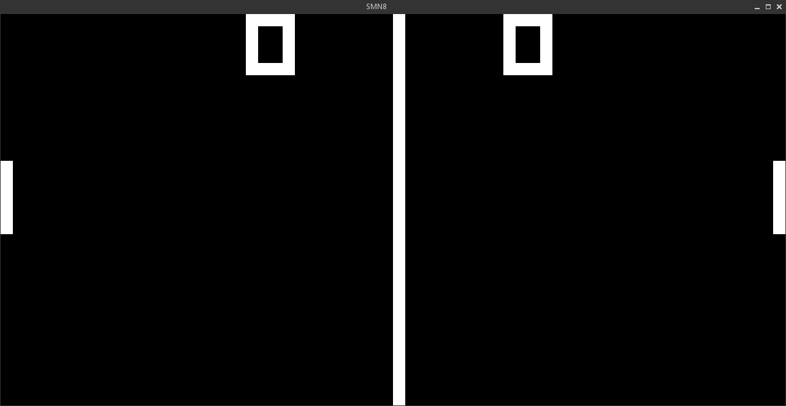

Simon8
======
Chip8 disassembler and emulator.




Getting Started
---------------
You'll need a C compiler (i.e gcc or clang), SDL2 and premake4.

```bash
premake4 gmake
make -C build
```

Alternatively, with audio support enabled:

```bash
premake4 --with-audio gmake
make -C build
```

**WARNING: The beeps can be loud, adjust your audio volume before launching
any roms.**

```bash
build/disasm roms/MAZE
build/emulator roms/MAZE
```

On the other hand, if you want support for *arrow keys*:

```bash
premake4 --with-arrow-keys gmake
make -C build
```

This makes playing the *TETRIS* **ROM** fully enjoyable.

ROMS
----
The **ROMS** that have been included have been placed into the
*public domain* and can be found over [here](http://www.zophar.net/pdroms/chip8.html).

References
----------
* [https://en.wikipedia.org/wiki/CHIP-8](https://en.wikipedia.org/wiki/CHIP-8)
* [http://devernay.free.fr/hacks/chip8/C8TECH10.HTM](http://devernay.free.fr/hacks/chip8/C8TECH10.HTM)
* [http://mattmik.com/chip8.html](http://mattmik.com/chip8.html)

Contribute
----------
* Fork the project.
* Make your feature addition or bug fix.
* Do **not** bump the version number.
* Send me a pull request. Bonus points for topic branches.

License
-------
Copyright (c) 2015, Mihail Szabolcs

Simon8 is provided **as-is** under the **MIT** license.
For more information see LICENSE.
